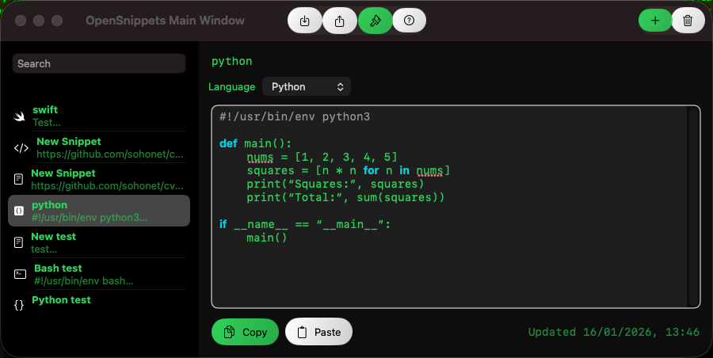

# OpenSnippets

A macOS application for storing, managing, and quickly accessing code snippets. OpenSnippets is designed to boost your productivity by keeping your most used code fragments organized and readily available.

## Features

-   **Improved UI/UX**: Experience a refreshed design with intuitive navigation, redesigned theme settings, and overall aesthetic enhancements for a smoother workflow.
-   **Fixed Paste Functionality**: Enjoy reliable pasting; the application now correctly overwrites selected text, ensuring your snippets are inserted precisely where intended.
-   **Updated Language Icons**: Visual cues for various programming languages are now more accurate and consistent, making it easier to identify your snippets at a glance.
-   **Snippet Reordering**: Organize your snippets effortlessly with drag-and-drop functionality, allowing you to reorder items in the list to suit your preferences.
-   **Snippet Management**: Full control over your code library: easily create new snippets, edit existing ones, and delete those you no longer need.
-   **Import/Export Functionality**: Securely back up your snippets or share them with others. Export all your snippets to a single, human-readable JSON file. You can also import snippets from a previously exported JSON file, making migration and collaboration seamless.
-   **Syntax Highlighting**: Leverage the power of [Highlightr](https://github.com/raspu/Highlightr), a Swift wrapper for the popular [highlight.js](https://highlightjs.org/) library, to get beautiful and accurate syntax highlighting for a vast array of languages.
-   **Customizable Themes**:
    -   Choose from a curated list of preset themes to instantly change the look and feel of your editor.
    -   Dive deeper into customization with color pickers and font settings to tailor the theme precisely to your visual preferences.
-   **Dynamic Variable Expansion**: Enhance your snippets with powerful placeholders that expand dynamically upon insertion:
    -   `{{date}}`: Inserts the current date.
    -   `{{time}}`: Inserts the current time.
    -   `{{datetime}}`: Inserts the current date and time.
    -   `{{clipboard}}`: Inserts the current content of your system clipboard.
-   **Clipboard Integration**: Seamlessly copy snippets to your system clipboard for quick pasting into any application. You can also paste content from your clipboard directly into new or existing snippets.
-   **Local Storage**: All your snippets are safely and securely saved locally to a JSON file on your macOS device.
-   **Spell Checking**: The built-in editor includes robust spell-checking capabilities to help you maintain clean and error-free comments and text within your snippets.

## Screenshots



*(Note: Please replace this placeholder image with an actual screenshot from the application. Create a directory named `Screenshots` at the root of the project and place your image files there, ensuring the filenames match the one referenced above.)*

## Getting Started

### Prerequisites

To build and run OpenSnippets, you will need:

-   macOS (latest stable version recommended)
-   Xcode (latest stable version recommended, available on the Mac App Store)

### Installation

1.  **Clone the Repository**:
    Begin by cloning the OpenSnippets GitHub repository to your local machine:
    ```bash
    git clone https://github.com/oscampbell/OpenSnippets.git
    ```

2.  **Navigate to Project Directory**:
    Change into the newly cloned project directory:
    ```bash
    cd OpenSnippets
    ```

3.  **Open in Xcode**:
    Open the project in Xcode. This will allow you to manage dependencies, build, and run the application using the Xcode IDE:
    ```bash
    open OpenSnippets.xcodeproj
    ```

### Building and Running

You have two primary methods to build and run OpenSnippets:

#### Using Xcode IDE

1.  **Select Scheme**: In Xcode, ensure that the "OpenSnippets" scheme is selected from the scheme dropdown menu (usually next to the Play/Stop buttons).
2.  **Select Target**: Choose "My Mac" or your preferred macOS device as the build target.
3.  **Build and Run**: Press `Cmd + R` (or click the Play button) to build the project and launch the application.

#### Using Command Line (xcodebuild)

For developers who prefer command-line workflows or for automation, you can build the project using `xcodebuild`:

1.  **Build the Project**: Execute the following command from the project's root directory. This will compile the application in `Debug` configuration.
    ```bash
    xcodebuild -project OpenSnippets.xcodeproj -scheme OpenSnippets -configuration Debug build
    ```
2.  **Locate the Built Application**: After a successful build, the application bundle (`.app`) will be located in the Derived Data directory. A typical path is:
    `/Users/<your_username>/Library/Developer/Xcode/DerivedData/OpenSnippets-<hash>/Build/Products/Debug/OpenSnippets.app`
    (The `<hash>` part will be a unique identifier for your build.)

3.  **Run the Application**: You can launch the built application directly from the command line:
    ```bash
    open /Users/<your_username>/Library/Developer/Xcode/DerivedData/OpenSnippets-<hash>/Build/Products/Debug/OpenSnippets.app
    ```
    Replace `<your_username>` and `<hash>` with your specific values.

## Usage

Once OpenSnippets is running, you can start managing your code snippets:

*   **Creating New Snippets**: Click the "+" button or use the appropriate menu item to create a new snippet. Enter a title, assign a language for syntax highlighting, and paste your code.
*   **Editing Snippets**: Select a snippet from the list, and its content will appear in the editor. Make your changes and they will be saved automatically.
*   **Deleting Snippets**: Select a snippet and press the Delete key, or use the menu option to remove it.
*   **Reordering Snippets**: Drag and drop snippets in the sidebar list to organize them in your preferred order.
*   **Dynamic Variables**: Utilize `{{date}}`, `{{time}}`, `{{datetime}}`, and `{{clipboard}}` in your snippet content. When you copy the snippet to the clipboard, these placeholders will be automatically expanded with their respective values.
*   **Theme Customization**: Access theme settings through the application's preferences. Experiment with different preset themes or fine-tune individual color components and font styles to create your ideal coding environment.
*   **Import/Export**: Use the import/export features from the File menu to manage your snippet collection, ensuring data portability and backup.

## Contributing

We welcome contributions to OpenSnippets! If you have suggestions for new features, bug fixes, or improvements, please feel free to:

1.  Fork the repository.
2.  Create a new branch for your feature or bug fix.
3.  Make your changes and commit them with descriptive messages.
4.  Push your changes to your fork.
5.  Open a Pull Request to the `main` branch of the original repository.

## License

OpenSnippets is released under the [MIT License](LICENSE).